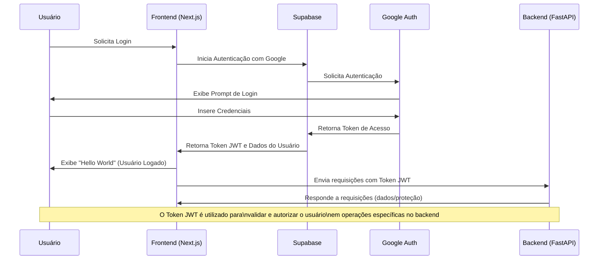

# Dental Web Backend

# Autenticação

```mermaid
sequenceDiagram
    participant Usuario as Usuário
    participant NextJS as Frontend (Next.js)
    participant Supabase as Supabase
    participant Google as Google Auth
    participant FastAPI as Backend (FastAPI)

    Usuario->>NextJS: Solicita Login
    NextJS->>Supabase: Inicia Autenticação com Google
    Supabase->>Google: Solicita Autenticação
    Google->>Usuario: Exibe Prompt de Login
    Usuario->>Google: Insere Credenciais
    Google->>Supabase: Retorna Token de Acesso
    Supabase->>NextJS: Retorna Token JWT e Dados do Usuário
    NextJS->>Usuario: Exibe "Hello World" (Usuário Logado)
    NextJS->>FastAPI: Envia requisições com Token JWT
    FastAPI->>NextJS: Responde a requisições (dados/proteção)
    Note over Usuario, FastAPI: O Token JWT é utilizado para\nvalidar e autorizar o usuário\nem operações específicas no backend
```
